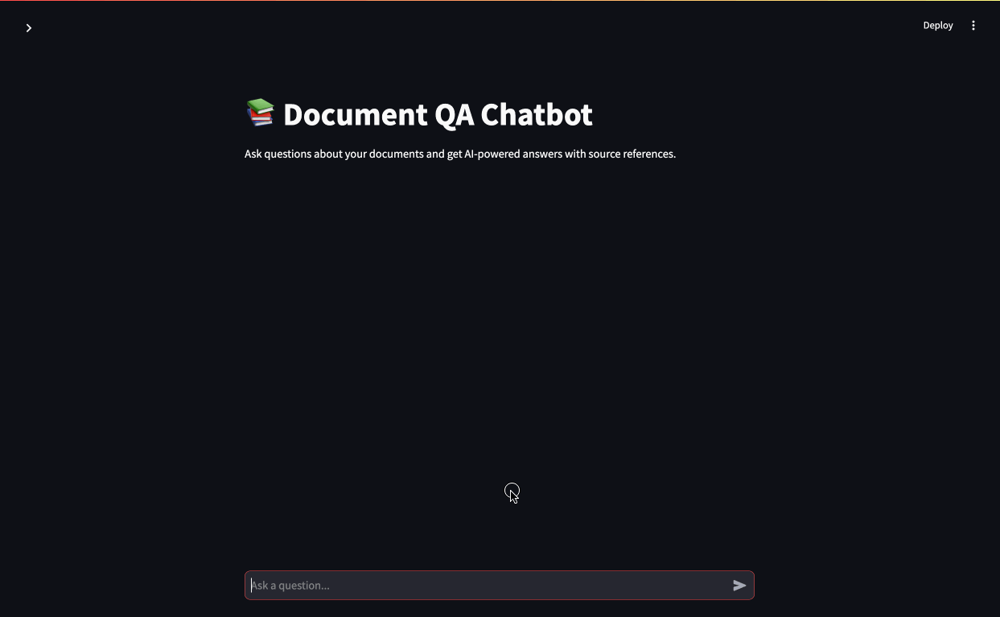

# CrateDB RAG / Hybrid Search PDF Chat Bot

## Introduction

This is a demo application that uses CrateDB as a data store for an AI powered chatbot.  



Source data / knowledge is extracted from text and images inside PDF documents, converted to vector embeddings, then stored in CrateDB.  It's also stored as plain text with a full-text index.

Users ask questions of this knowledge base using a natural language chat bot interface.  The code performs a hybrid search (K nearest neighbor and full-text keyword) over the data, using the results as context for an LLM to generate a natural language response.

For a detailed explanation of how this project works, check out our blog series on the topic:

* **Part One:** [Building AI Knowledge Assistants for Enterprise PDFs: A Strategic Approach](https://cratedb.com/blog/building-ai-knowledge-assistants-for-enterprise-pdfs).
* **Part Two:** [Core Techniques Powering Enterprise Knowledge Assistants](https://cratedb.com/blog/core-techniques-in-an-enterprise-knowledge-assistants).
* **Part Three:** [Designing the Consumption Layer for Enterprise Knowledge Assistants](https://cratedb.com/blog/designing-the-consumption-layer-for-enterprise-knowledge-assistants).
* **Part Four:** [Step by Step Guide to Building a PDF Knowledge Assistant](https://cratedb.com/blog/step-by-step-guide-to-building-a-pdf-knowledge-assistant).

If you prefer to see the details as a single document, [here'a a markdown version in GitHub](https://github.com/crate/cratedb-examples/tree/main/topic/chatbot).

## Prerequisites

To run this project you'll need to install the following software:

* Python 3 ([download](https://www.python.org/downloads/)) - we've tested this project with Python 3.12 on macOS Sequoia.
* Git command line tools ([download](https://git-scm.com/downloads)).
* Your favorite code editor, to edit configuration files and browse/edit the code if you wish.  [Visual Studio Code](https://code.visualstudio.com/) is great for this.
* Access to a cloud or local CrateDB cluster (see below for details).
* Some PDF files that you want to use as the source data for the chat bot.

You'll also need an OpenAI API key with sufficient credits to run the code.  Obtain an API key and see pricing here: [OpenAI API Pricing](https://openai.com/api/pricing/).

## Getting the Code

Next you'll need to get a copy of the code from GitHub by cloning the repository.  Open up your terminal and change directory to wherever you store coding projects, then enter the following commands:

```bash
git clone https://github.com/crate/devrel-offshore-wind-farms-demo.git
cd devrel-pdf-rag-chatbot
```

## Getting a CrateDB Database

You'll need a CrateDB database to store the project's data in.  Choose between a free hosted instance in the cloud, or run the database locally.  Either option is fine.

### Cloud Option

Create a database in the cloud by first pointing your browser at [`console.cratedb.cloud`](https://console.cratedb.cloud/).

Login or create an account, then follow the prompts to create a "CRFREE" database on shared infrastructure in the cloud of your choice (choose from Amazon AWS, Microsoft Azure and Google Cloud).  Pick a region close to where you live to minimize latency between your machine running the code and the database that stores the data. 

Once you've created your cluster, you'll see a "Download" button.  This downloads a text file containing a copy of your database hostname, port, username and password.  Make sure to download these as you'll need them later and won't see them again.  Your credentials will look something like this example (exact values will vary based on your choice of AWS/Google Cloud/Azure etc):

```
Host:              some-host-name.gke1.us-central1.gcp.cratedb.net
Port (PostgreSQL): 5432
Port (HTTPS):      4200
Database:          crate
Username:          admin
Password:          the-password-will-be-here
```

Wait until the cluster status shows a green status icon and "Healthy" status before continuing.  Note that it may take a few moments to provision your database.

### Local Option

The best way to run CrateDB locally is by using Docker.  We've provided a Docker Compose file for you.  Once you've installed [Docker Desktop](https://www.docker.com/products/docker-desktop/), you can start the database like this:

```bash
docker compose up
```

Once the database is up and running, you can access the console by pointing your browser at:

```
http://localhost:4200
```

Note that if you have something else running on port 4200 (CrateDB admin UI) or port 5432 (Postgres protocol port) you'll need to stop those other services first, or edit the Docker compose file to expose these ports at different numbers on your local machine.

## Preparing the PDF Files

The chat bot uses data extracted from PDF files.  This can include text and images.  Place one or more PDF files in the `chatbot/static` folder before running either component.  The data extractor component will read these, extract data from them and store it in CrateDB.  The chat bot component's web interface uses the PDFs as static assets, so that links to the original document can be presented as part of the chat bot's response.

We've included a couple of CrateDB White Papers in PDF format to get you started.  You'll find them in the `chatbot/static` folder.

## Configuring and Running Each Component

This project is organized into two components, each contained in their own folder with their own `README` document.  You'll find further instructions for each component in its folder.

* The **data extractor** component can be found in the [data-extractor](./data-extractor/) folder. This component is responsible for reading PDF files, extracting and chunking the text data and generating text descriptions of images.  The data is then stored in CrateDB for full-text and vector similarity searches.
* The **chat bot** component is contained in the [`chatbot`](./chatbot/) folder.  This component receives plain text queries from users, performs a hybrid vector and full-text search over data that the data extractor stored in CrateDB, and presents the results as a chatbot response.

## CrateDB Academy

Want to learn more about CrateDB? Take our free online "CrateDB Fundamentals" course, available now at the [CrateDB Academy](https://cratedb.com/academy/fundamentals/).